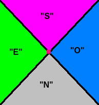

# Introducción a la solución

Podemos dibujar un pequeño diagrama que nos indique la lectura de la brújula en
relación a la singularidad.



La brújula leerá "IND" cuando se encuentre en alguna de las dos rectas negras,
y en ese caso la singularidad se encontrará a 45º del punto de lectura. Podemos
observar que las lecturas a izquierda y derecha de un punto perteneciente a la
recta serán siempre diferentes.

Podemos resolver el problema encontrando un punto correspondiente a cada una de
las rectas negras, ya que la singularidad se encontrará en la intersección
entre ambas rectas.

Para ello, podemos realizar una búsqueda dicotómica (*binary search*), donde
dejando una coordenada fija (*x* o *y*) haremos un barrido sobre la otra
coordenada, buscando el primer punto donde la lectura sea "IND". La búsqueda
dicotómica deberá empezar con dos valores de coordenadas que tengan lecturas
diferentes y adyacentes, para poder delimitar tres regiones entre ambos puntos:
puntos donde la lectura es un punto cardinal, puntos donde la lectura es otro
punto cardinal y el punto buscado en el que la lectura es "IND".

Una vez tengamos nuestros puntos y hayamos identificado a qué pendiente
corresponde a la recta que pasa por cada uno de ellos, basta con encontrar la
intersección entre ambas rectas utilizando las ecuaciones de la recta $y = m
\cdot x + b$.

Hemos de tener cuidado de no caer en la zona de exclusión al hacer nuestras
consultas. Para eso, tenemos dos opciones.

## Opción 1 para evitar la zona de exclusión: Arenópolis

Sabemos que Arenópolis se encuentra fuera de la zona de exclusión. Si se nos
indica que Arenópolis está al norte o al sur de la singularidad, podemos
movernos de este a oeste con seguridad; si Arenópolis se encuentra al este u
oeste de la singularidad, podemos movernos al norte o al sur con seguridad.

Si la brújula leyese "IND" en Arenópolis, podemos movernos con seguridad en
cualquier dirección, así que en ese caso nos moveremos en una dirección
arbitraria antes de comenzar la búsqueda dicotómica.

Buscaremos en horizontal o en vertical (en función de la lectura de la brújula)
dos puntos distintos. Puesto que el desierto es mucho mayor que las posibles
ubicaciones de Arenópolis y la singularidad, podemos estar seguro que sean
cuales sean las coordenadas $(x_A, y_A)$ de Arenópolis, $(x_A, 10^{-9})$ leerá
"N", $(x_A, 10^{9})$ leerá "S", $(10^{-9}, y_A)$ leerá "E" y $(10^{9}, y_A)$
leerá "O".

Por lo tanto, lanzamos dos búsquedas en la misma dirección: una desde un
extremo hasta $(x_A, y_A)$, y otra desde $(x_A, y_A)$ hasta el otro extremo.
Esto nos garantizará encontrar dos puntos "IND", cada uno perteneciente a una
recta distinta.

A continuación, calcularíamos la pendiente de la recta que pasa por cada punto
viendo cómo cambia la lectura de la brújula si nos movemos ligeramente en
alguna dirección.

## Opción 2 para evitar la zona de exclusión: ignorar Arenópolis

Sabemos que tanto Arenópolis como la singularidad tienen ambas coordenadas $(x,
y)$ entre $\[-10^8, 10^8\]$. Sabemos además que Arenópolis nunca estará
dentro de la zona de exclusión. Lo más grande que puede ser la dimensión de la
zona de exclusión desde el centro de la singularidad es por tanto
$2 \cdot 10^8 - 1$, si colocásemos la singularidad y Arenópolis en vértices
opuestos del cuadrado. En ese caso, suponiendo que la singularidad se encuentre
en la coordenada $y_s$ más alta, $y_s = 10^8$, la zona de exclusión se extenderá
hasta $y_{e} = 10^8 + 2 \cdot 10^8 - 1 = 3 \cdot 10^8 - 1$. Por lo tanto, la
coordenada $y_s = 3 \cdot 10^8$ siempre estará fuera de la zona de exclusión y
será seguro consultarla.

Podemos calcular puntos $(x, y_s)$ donde la lectura siempre sea la misma
independientemente de la singularidad (un punto donde siempre se lea "E", otro
donde siempre se lea "S" y otro donde siempre se lea "O"). De esta forma,
podemos lanzar la búsqueda dicotómica entre los puntos "E" y "S" para obtener
el punto correspondiente a la recta de pendiente $-1$, y luego entre el punto
"S" y "O" para obtener el punto correspondiente a la recta de pendiente $+1$.

Una vez disponemos de ambos puntos $(x_1, y_s)$, $(x_2, y_s)$, la singularidad
se encontrará en $(\frac{x_1 + x_2}{2}, y_s - (\frac{x_1 + x_2}{2} - x_1))$.

# Posibles errores

- Explorar zonas fuera del rango $[-10^8, 10^8]$ que intersectan con la zona de
  exclusión de la singularidad.

# Juez propio
Puesto que es un problema interactivo, se ha desarrollado un juez propio que se
puede lanzar como:

```bash
python3 ./judge.py <ejecutable_solucion>
```

El juez ejecuta 700 casos de prueba aleatorios y comprueba si el programa
encuentra correctamente la respuesta en menos de 100 consultas por cada caso de
prueba.

# Soluciones

|                          Solución                          |    Consultas medias   |    Verificado con el juez   |
|:----------------------------------------------------------:|:---------------------:|:---------------------------:|
|[C.py](src/C.py)                                            |        ~55.34         | :white_check_mark:          |
|[C_Arenopolis.cpp](src/C_Arenopolis.cpp)                    |        ~61.77         | :warning: (con juez propio) |
|[C_sin_Arenopolis.cpp](src/C_sin_Arenopolis.cpp)            |        ~55.32         | :warning: (con juez propio) |
