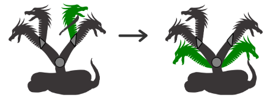
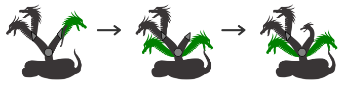

# Problema H - Trhidra

Como penitencia por el asesinato, en un ataque de locura, de su mujer,
hijos y dos sobrinos, Hércules tuvo que cumplir los que se conocen como
“los doce trabajos de Hércules”. El segundo de ellos fue matar a la hidra
de Lerna, un monstruo acuático con forma de serpiente y nueve cabezas
de dragón. Cada vez que Hércules conseguía cortar una cabeza, se regene-
raban dos más. Consiguió vencer al monstruo con la ayuda de su sobrino
Yolao, quien con una antorcha quemaba el cuello de la hidra tras el corte
de cada cabeza para evitar el surgimiento de las dos nuevas.

Un subgénero de las hidras, quizá más espantoso, son las *trhidras*. Del
cuerpo de la serpiente surgen cuellos que, a veces, no acaban en cabezas,
sino que antes se ramifican, incluso varias veces. Cuando una cabeza es
cortada, surgen las réplicas, igual que en las hidras, pero no en el mismo
punto donde estaba la recién cortada, sino en la ramificación inmediata-
mente anterior del cuello.

Por ejemplo, si del cuerpo de una determinada *trhidra* salen dos cuellos,
cada uno con una ramificación de la que surgen dos cabezas, al cortar una
cabeza surgen dos nuevas en la ramificación anterior que, en este caso,
resulta ser el cuerpo.



Cuando se eliminan todas las cabezas de un punto de ramificación, este se
convierte en una cabeza que debe también ser cortada, lo que ocasiona el
surgimiento de las réplicas un nivel por debajo.



Pese a la fiereza de la *trhidra*, terminar con todas sus cabezas es más sencillo
que en el caso de las hidras, porque las cabezas que surgen directamente del
cuerpo, y no de un cuello ramificado, no se regeneran, al estar en el primer
nivel de ramificación y no haber uno anterior. Cuando todas las cabezas que
surgen del cuerpo son cortadas, la *trhidra* muere.

## Entrada
Cada caso de prueba comienza con un primer número, entre 1 y 10, que indica el
poder de replicación de una *trhidra*, es decir el número de cabezas que surgen,
un nivel de ramificación por debajo, cada vez que se corta una cabeza.

En la segunda línea de cada caso de prueba aparecen entre 2 y 10.000 números
con la descripción de la *trhidra*. Primero se indica la ramificación del cuerpo
(número de cuellos principales) y a continuación aparece la descripción,
siguiendo este mismo esquema, de cada uno de ellos. Un cuello sin ramificación
se indica con un 0, que terminará en una cabeza. Ningún cuello tiene una
ramificación mayor que 10.

A veces la *trhidra* ha pasado por batallas anteriores y tiene algunas cabezas ya
cortadas, por lo que algún cuello podría tener una ramificación de 1.  La
entrada termina con un 0.

## Salida
Por cada caso de prueba se escribirá el número total de cabezas que tiene que
cortar Hércules para conseguir matar a la *trhidra*, teniendo en cuenta que las
va cortando de una en una. Dado que el número puede ser alto, se dará el valor
módulo $1.000.000.007$.

## Entrada de ejemplo
```
2
2 2 0 0 2 0 0
2
3 3 0 0 0 3 0 0 0 3 0 0 0
3
1 1 1 0
0
```

## Salida de ejemplo
```
14
30
18
```
