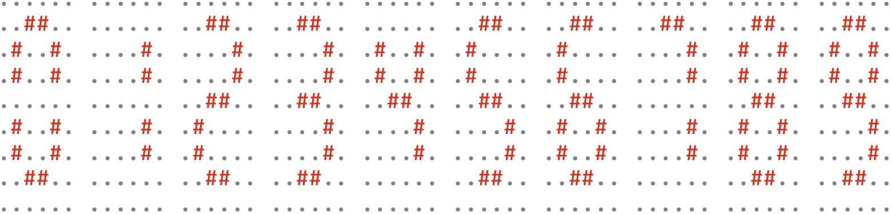
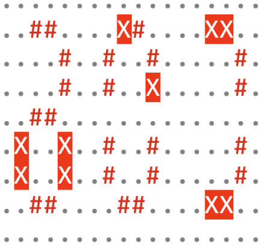

# Problema J - Misión de rescate: pantalla defectuosa

¡Atención, cadetes de la Flota Estelar! Durante una misión de rutina en el
espacio profundo, la nave SS Codebreaker, una de las naves más avanzadas de la
Flota, equipada con tecnología de última generación para explorar los confines
del universo y descifrar los misterios que guarda, ha sufrido un fallo en su
sistema de visualización.

La pantalla principal de la nave, que utiliza varios displays de siete
segmentos para mostrar información crucial sobre la navegación y el estado de
los sistemas, como coor- denadas espaciales y códigos de acceso, ha comenzado a
fallar debido a una tormenta de radiación cósmica que ha causado estragos en
los sistemas electrónicos de la nave. Algunos de los píxeles en estos displays
han comenzado a funcionar de forma errónea, haciendo difícil la interpretación
de los datos.

Debido a la importancia de estos, es vital determinar cuántos valores posibles
pueden estar represen- tados en la pantalla defectuosa. La misión y la
seguridad de la tripulación dependen de una interpretación correcta de estos
dígitos.

En condiciones normales, los dígitos se muestran de la siguiente manera:



Debido al comportamiento defectuoso, algunos de los píxeles que forman los
segmentos titilan, sin que podamos saber si deberían estar encendidos o
apagados. Por ejemplo, la pantalla podría mostrar un código, en este caso de
tres dígitos, de la siguiente manera (donde aparecen marcados con una X con
fondo rojo los píxeles titilantes):



El primer dígito que muestra la pantalla podría ser tanto un 2 como un 3; el
segundo dígito, aunque tiene también píxeles defectuosos, es inequívocamente un
0; y el tercer dígito podría ser tanto un 1 como un 7. Por lo tanto, el código
mostrado por la pantalla podría ser 201, 207, 301 ó 307.

Viendo un código mostrado por la pantalla defectuosa, ¿sabrías decir cuántos
códigos diferentes podría estar representando?

## Entrada
La entrada consta de una serie de casos de prueba (nunca más de 1.000). Cada
caso comienza con una línea con el número $N$ de dígitos mostrados por la
pantalla ($1 \leq N \leq 9$). A continuación aparecen 9 líneas de caracteres,
cada una con $6×N$ caracteres, los correspondientes a representar los $N$
dígitos.  El carácter ‘.’ representa un píxel apagado, el carácter ‘#’
representa un píxel encendido y el carácter ‘X’ representa un píxel titilante,
que no sabemos si debería estar encendido o apagado. Solamente los píxeles
pertenecientes a alguno de los siete segmentos puede estar encendido o ser
titilante. Llamamos segmento a cada uno de los siete grupos de dos caracteres
adyacentes en vertical u horizontal que en la representación del 8 se indican
con caracteres ‘#’.

La entrada termina con un 0 que no debe procesarse.

## Salida
Para cada caso de prueba se escribirá el número total de códigos que puede
estar representando la pantalla defectuosa.

## Entrada de ejemplo
```
3
..................
..##....X#....XX..
....#..#..#.....#.
....#..#..X.....#.
..##..............
.X..X..#..#.....#.
.X..X..#..#.....#.
..##....##....XX..
..................
1
......
..XX..
.X..X.
.X..X.
..##..
.X..X.
.X..X.
..XX..
......
0
```

## Salida de ejemplo
```
4
7
```
